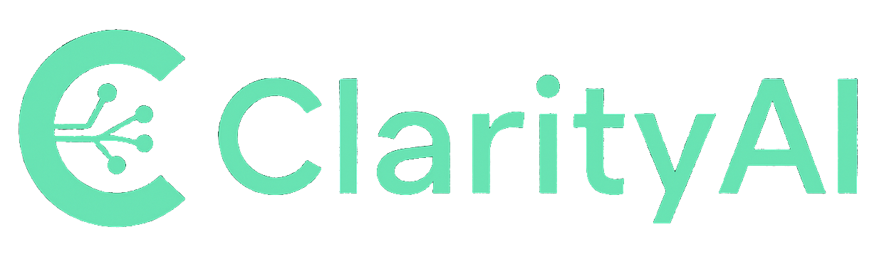

# 📊 YouTube Sales Funnel Dashboard

<div align="center">
  
  
  **A comprehensive analytics dashboard for high-ticket coaching programs**
  
  Track your entire sales funnel from YouTube views to revenue with AI-powered insights
  
  [](https://nextjs.org/)
  [](https://www.typescriptlang.org/)
  [](https://tailwindcss.com/)
  [](https://reactjs.org/)
</div>

---

## 🎯 Overview

This dashboard provides a complete view of your sales funnel performance, from initial YouTube video views to final revenue generation. Built specifically for high-ticket coaching programs, it offers real-time analytics, AI-powered insights, and actionable recommendations to optimize your marketing funnel.

### 🔄 Sales Funnel Tracking

```
YouTube Video → Website Landing Page → Call Booked → Call Tracked → Sale → Email Follow-ups
     ↓              ↓                    ↓            ↓           ↓           ↓
  Analytics      Conversion           Cal.com      Notion      Kajabi     Email Stats
```

## ✨ Key Features

### 📈 **Dashboard Analytics**
- **Monthly Performance Metrics**: Track YouTube views, website visitors, calls booked, accepted calls, and revenue
- **Real-time Conversion Rates**: Monitor each step of your sales funnel with live conversion percentages
- **Revenue Breakdown**: Separate tracking for full payments vs. installments
- **Month-over-Month Growth**: Visual indicators showing performance trends and growth patterns

### 🎥 **Video Attribution**
- **Performance per Video**: See which YouTube videos drive the most qualified leads and revenue
- **ROI Analysis**: Calculate revenue per view and conversion rates for each video
- **Lead Source Tracking**: Full attribution from video view to final sale
- **Video Leaderboard**: Rank your content by performance and profitability

### 🤖 **AI-Powered Insights**
- **Monthly Summaries**: Automated executive summaries highlighting key trends and wins
- **Performance Recommendations**: AI suggestions for content optimization and funnel improvements
- **Drop-off Analysis**: Identify where leads are falling out of your funnel
- **Trend Predictions**: Forecasting based on historical performance data

### 📊 **Advanced Visualizations**
- **Interactive Charts**: Responsive charts built with modern data visualization libraries
- **Funnel Visualization**: Clear visual representation of lead progression through each stage
- **Trend Analysis**: Line charts showing performance evolution over time
- **Comparative Analytics**: Side-by-side month comparisons with percentage changes

## 🛠️ Tech Stack

### **Frontend**
- **Framework**: Next.js 15.3.4 with App Router and Turbopack
- **Language**: TypeScript 5.0+
- **Runtime**: React 19.0
- **Styling**: Tailwind CSS 4.0 with custom design system
- **UI Components**: Custom components with Lucide React icons
- **Charts**: Chart.js 4.5 with React Chart.js 2 integration
- **Animations**: Framer Motion 12.18 for smooth interactions
- **Utils**: clsx and tailwind-merge for conditional styling

### **Backend & APIs**
- **API Integration**: YouTube scrapper API
- **Mock server actions**: Simulated Kajabi and Cal.com endpoints
- **AI Integration**: Anthropic Claude AI for insights generation
- **Data Management**: Server Actions for optimized data fetching
- **Package Manager**: PNPM for efficient dependency management

### **Design System**
- **Theme**: Dark mode with mint green (#9df5c4) accents
- **Typography**: Inter font family
- **Layout**: CSS Grid with responsive breakpoints
- **Accessibility**: WCAG 2.1 AA compliant

## 🚀 Getting Started

### Prerequisites
- Node.js 18.17 or later
- PNPM package manager
- YouTube scrapper API key - [Youtube Scrapper](https://rapidapi.com/premium-apis-oanor/api/youtube-scraper3)

### Installation

1. **Clone the repository**
```bash
git clone https://github.com/yourusername/yt-dashboard.git
cd yt-dashboard
```

2. **Install dependencies**
```bash
pnpm install
```

3. **Environment Setup**
```bash
# Create environment file
touch .env.local
```

4. **Configure environment variables**
```env
# YouTube API
RAPID_API_KEY=your_youtube_api_key_here
YOUTUBE_CHANNEL_ID=your_channel_id_here

# Anthropic API (For AI insights)
ANTHROPIC_API_KEY=your_anthropic_api_key_here
```

5. **Run the development server**
```bash
pnpm dev
```

6. **Open your browser**
Navigate to [http://localhost:3000](http://localhost:3000)

### Key Pages
- **Dashboard**: `/dashboard` - Main analytics overview
- **Videos**: `/videos` - Individual video performance
- **Analytics**: `/analytics` - Detailed funnel analysis  
- **Insights**: `/insights` - AI-powered recommendations

## 📁 Project Structure

```
yt-dashboard/
├── app/                    # Next.js App Router
│   ├── (root)/            # Route groups
│   │   ├── analytics/     # Analytics page
│   │   ├── dashboard/     # Main dashboard
│   │   ├── insights/      # AI insights page
│   │   └── videos/        # Video performance page
│   ├── globals.css        # Global styles
│   └── layout.tsx         # Root layout
├── components/            # React components
│   ├── analytics/         # Analytics-specific components
│   ├── animations/        # Animation components
│   ├── auth/             # Authentication components
│   ├── dashboard/        # Dashboard components
│   ├── insights/         # AI insights components
│   ├── navbar/           # Navigation components
│   ├── ui/               # Reusable UI components
│   └── videos/           # Video components
├── lib/                   # Utilities and actions
│   ├── actions/          # Server actions
│   └── utils/            # Utility functions
├── public/               # Static assets
└── package.json          # Dependencies and scripts
```

## 📱 Usage Guide

### Dashboard Navigation

- **🏠 Dashboard**: Main overview with key metrics and trends
- **📹 Videos**: Individual video performance and attribution analysis
- **📊 Analytics**: Detailed charts and funnel visualization
- **🧠 Insights**: AI-generated recommendations and summaries

### Key Metrics Explained

| Metric | Description | Calculation |
|--------|-------------|-------------|
| **YouTube Views** | Total video views for the month | Sum of all video views |
| **Website Visitors** | Landing page visitors | Tracked via analytics |
| **Calls Booked** | Total appointments scheduled | Cal.com integration |
| **Show-up Rate** | Percentage of booked calls attended | (Attended / Booked) × 100 |
| **Conversion Rate** | Lead to sale conversion | (Sales / Leads) × 100 |
| **Revenue per View** | Average revenue generated per video view | Total Revenue / Total Views |

### Filtering & Time Ranges

- **Monthly View**: Default view showing current month
- **Quarterly View**: 3-month rolling window
- **Last 6 months**: 6-month rolling window
- **Last 12 months**: 12-month rolling window

## 🔌 API Reference

### Mock API Endpoints

The application includes simulated endpoints for demonstration:

#### Kajabi Revenue API
```typescript
GET /api/kajabi/monthly-revenue
Response: {
  month: string,
  new_cash_collected: {
    pif: number,
    installments: number
  },
  total_cash_collected: number,
  high_ticket_closes: {
    pif: number,
    installments: number
  }
}
```

#### Cal.com Calls API
```typescript
GET /api/cal/monthly-calls
Response: {
  month: string,
  total_booked: number,
  accepted: number,
  show_ups: number,
  video_sources: Array<{
    video_id: string,
    calls_booked: number,
    accepted: number,
    show_ups: number
  }>
}
```

### YouTube Integration

The app integrates with the [YouTube scrapper API](https://rapidapi.com/premium-apis-oanor/api/youtube-scraper3) to fetch:
- Video metadata (title, thumbnail, views, publish date)

## 🎨 Design System

### Color Palette
```css
/* Primary Colors */
--primary-dark: #1a1a1a;
--primary-darker: #0f0f0f;
--primary-darkest: #000000;

/* Accent Colors */
--accent-mint: #9df5c4;
--accent-mint-dark: #7de3a0;

/* Semantic Colors */
--success: #9df5c4;
--warning: #ffd700;
--error: #ff6b6b;
```

### Component Architecture
- **Atomic Design**: Components organized by complexity (atoms → molecules → organisms)
- **Responsive**: Mobile-first design with breakpoints at 768px, 1024px, 1280px


## 🧪 Development Commands

```bash
# Development
pnpm dev              # Start development server with Turbopack
pnpm dev:debug        # Start with debugging enabled
pnpm build            # Build for production
pnpm start            # Start production server
pnpm lint             # Run ESLint

# Analysis
pnpm analyze          # Analyze bundle size
pnpm type-check       # Run TypeScript compiler

# Testing (when implemented)
pnpm test             # Run unit tests
pnpm test:watch       # Run tests in watch mode
pnpm test:coverage    # Generate coverage report
```

## 🚀 Deployment

### Vercel (Recommended)
```bash
# Deploy to Vercel
pnpm build
vercel --prod
```

### Docker
```bash
# Build Docker image
docker build -t yt-dashboard .

# Run container
docker run -p 3000:3000 yt-dashboard
```

### Environment Variables for Production
Ensure these are set in your production environment:
- `RAPID_API_KEY`
- `ANTHROPIC_API_KEY`
- `YOUTUBE_CHANNEL_ID`


---

<div align="center">
  <p>Built with ❤️ for my mentor - Zaurbek Tsoroev</p>
  <p>© 2025 YouTube Dashboard. All rights reserved.</p>
</div>
